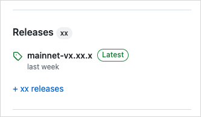

<ImportContent source="info-easy-install" mode="snippet" />

Each Rtd release provides a set of binaries for several operating systems. You can download these binaries from GitHub and use them to install Rtd.

<Tabs groupId="operating-systems">

<TabItem value="linux" label="Linux">

1. Go to the [Rtd GitHub repository](https://github.com/LinkUVerse/rtd).
1. In the right pane, find the **Releases** section.

    
1. Click the release tagged **Latest** to open the release's page.
1. In the **Assets** section of the release, select the .tgz compressed file that corresponds to your operating system.
1. Extract all files from the .tgz file into the preferred location on your system. These instructions assume you extract the files into a `rtd` folder at the user root of your system for demonstration purposes. Replace references to this location in subsequent steps if you choose a different directory.
1. Navigate to the expanded folder. You should have the following extracted files:

    <ImportContent source="lists/binaries-file-list" mode="snippet" />

1. Add the folder containing the extracted files to your `PATH` variable. To do so, you can update your `~/.bashrc` to include the location of the Rtd binaries. If using the suggested location, you type `export PATH=$PATH:~/rtd` and press Enter.
1. Start a new terminal session or type `source ~/.bashrc` to load the new `PATH` value.

</TabItem>

<TabItem value="mac" label="macOS">

1. Go to the [Rtd GitHub repository](https://github.com/LinkUVerse/rtd).
1. In the right pane, find the **Releases** section.

    
1. Click the release tagged **Latest** to open the release's page.
1. In the **Assets** section of the release, select the .tgz compressed file that corresponds to your operating system.
1. Extract all files from the .tgz file into the preferred location on your system. These instructions assume you extract the files into a `rtd` folder at the user root of your system. Replace references to this location in subsequent steps if you choose a different directory.
1. Navigate to the expanded folder. You should have the following extracted files:

    <ImportContent source="lists/binaries-file-list" mode="snippet" />

1. Add the folder containing the extracted files to your `PATH` variable. To do so, you can update your `~/.zshrc` or `~/.bashrc` to include the location of the Rtd binaries. If using the suggested location, you type `export PATH=$PATH:~/rtd` and press Enter.
1. Start a new console session or type `source ~/.zshrc` (or `.bashrc`) to load the new `PATH` value.
1. If running the binaries for the first time, you might receive an error from MacOS that prevents the binaries from running. If you receive this error, close the dialog and type `xattr -d com.apple.quarantine ~/rtd/*` in your console and press <kbd>Enter</kbd> (be sure to adjust the path if different).

</TabItem>

<TabItem value="win" label="Windows">

1. Go to the [Rtd GitHub repository](https://github.com/LinkUVerse/rtd).
1. In the right pane, find the **Releases** section.

    
1. Click the release tagged **Latest** to open the release's page.
1. In the **Assets** section of the release, select the .tgz compressed file that corresponds to your operating system.
1. Extract all files from the .tgz file into the preferred location on your system. These instructions assume you extract the files into a `rtd` folder at the root of your C drive. Replace references to this location in subsequent steps if you choose a different directory.

    :::info

    Windows does not natively support .tgz files, but you can use a free compressed file app like [7Zip](https://7-zip.org/) to extract.

    :::

1. Navigate to the expanded folder. You should have the following extracted files:

    <ImportContent source="lists/binaries-file-list" mode="snippet" />

1. Add the folder containing the extracted files to your `PATH` variable. There are several ways to get to the setting depending on your version of Windows. One way that works on all versions of Windows is to type `sysdm.cpl` in a console to open the System Properties window. Under the **Advanced** tab, click the **Environment Variables...** button.
1. In the Environment Variables window, select the `Path` variable and click the **Edit...** button.
1. In the Edit environment variable window, click **New** and add the path to your expanded folder. Using the example path, this would be `C:\rtd`.
1. Click **OK**.

</TabItem>

</Tabs>

## Build binaries locally

You can download the Rtd repo and build the binaries locally. The binaries are exported to the `target/release` directory.
    
```sh
$ cargo build --profile release --bin rtd --features tracing
```

The `--features tracing` flag enables Move test coverage and debugger support. Include other packages as needed.

<ImportContent source="lists/binaries-file-list" mode="snippet" />

## Upgrade from Cargo

:::info
Consider switching to [`suiup`](/getting-started/onboarding/rtd-install) for upgrades. It handles version pinning and network-specific builds without long compile times.
:::

If you previously installed the Rtd binaries with Cargo, you can update them to the most recent release with the same command you used to install them (changing `testnet` to the desired branch). Always include `--features tracing`:

```sh
$ cargo install --locked --git https://github.com/LinkUVerse/rtd.git --branch testnet rtd --features tracing
```

:::info

The `tracing` feature enables Move test coverage and debugger support in the Rtd CLI. These features are not available unless you include `--features tracing`.

:::

## Install `rtd-node` for Ubuntu from AWS {#aws-rtd-node}

<ImportContent source="install-rtd-node" mode="snippet" />

## Verify the installation

After installing, open a new terminal and run:

```sh
$ rtd --version
```

If the installation succeeded, the command prints the installed Rtd version.

