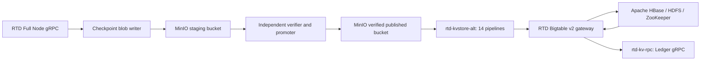

<ImportContent source="indexer-archival" mode="snippet" />

RTD has no verified public Mainnet, archival endpoint, or checkpoint bucket.
The examples on this page are templates for a network that you operate. Verify
its genesis digest and chain ID before writing an empty historical database or
accepting an object source. Do not copy Sui public hostnames into RTD configs.

**RTD production requires self-hosted open-source middleware.** The object
store is an RTD-operated MinIO deployment; `S3` names its open API protocol.
The historical row store is Apache HBase on self-hosted HDFS and ZooKeeper.
The RTD gateway implements only the Bigtable v2 wire operations needed by the
current Rust clients. There is no Google Bigtable, Google Cloud Storage,
Amazon S3, Azure Blob, or other managed cloud data service in this topology.

The [MinIO Community server source](https://github.com/minio/minio) remains
AGPLv3 open source but its official repository is archived and no longer
maintained. RTD must lock and maintain its own source revision, security fixes,
builds, and SBOM; have its AGPLv3 use reviewed; and prove production recovery
before releasing this design. A free-to-use proprietary edition does not meet
the open-source requirement.

## Components and trust boundary



The writer can write staging objects but indexers cannot read that bucket.
The verifier pins source VersionIds, checks checkpoint certificates, chain
identity, continuity, object digest, and publish order, then writes immutable
objects to the published bucket. Consumers have read-only access to the
published bucket. A watermark JSON file in the writer's bucket cannot enforce
this boundary: the standard indexers can fetch higher numbered objects
directly. RTD's local MinIO proof demonstrated this behavior; a production
verifier and durable fact ledger still need implementation and fault testing.

| Service | Required production owner and role |
| --- | --- |
| MinIO | RTD-maintained AGPLv3 build, distributed erasure coding, separate staging and published buckets, versioning, least-privilege identities, independent backup or replication. |
| HBase/HDFS/ZooKeeper | RTD-operated multi-node historical store; 14 tables with the `rtd` column family and consistent backup/restore procedure. |
| HBase compatibility gateway | Private gRPC endpoint for the current Bigtable v2 data-plane subset. The protocol package name is an encoding contract, not a Google service. |
| `rtd-kvstore-alt` | Official 14-pipeline indexer, reading verified RTD checkpoint objects and writing through the private gateway. |
| `rtd-kv-rpc` | Official Ledger gRPC service, reading the same HBase instance and exposing historical queries. |

Build `rtd-kvstore-alt` and `rtd-kv-rpc` from the same reviewed RTD commit and
`Cargo.lock`. Use a self-hosted image registry for released images. The
`rtd-archive-service` sibling repository records the source lock, development
Compose setup, gateway implementation, and acceptance evidence. Its single
node development services are not production high availability.

## Prepare the storage and gateway

1. Provision a distributed MinIO deployment across independent hosts and
   disks. Enable versioning on both buckets before accepting checkpoint 0.
   Configure separate identities for writer, verifier, and consumers. Test
   conditional writes, overwrite rejection, object lock or retention, pinned
   version reads, replication, and restoring into an isolated deployment.
2. Provision HBase with HDFS and ZooKeeper across fault domains. Create the
   14 tables expected by the current RTD binary with one `rtd` column family.
   The development table list and initialization logic are in
   `rtd-archive-service/localDeploy/hbase`; use production sizing and backups
   appropriate to the actual RTD chain rather than copying its single-node
   volumes.
3. Start the RTD HBase compatibility gateway on a private address. Configure
   server CA, client certificate and key for each Rust client. In production,
   plaintext gateway connections are forbidden. The logical `INSTANCE_ID`
   argument remains part of the inherited client contract; it does not select
   a Google Bigtable instance.
4. Before the first HBase write, verify the genesis digest, source checkpoint
   0 and expected chain ID with an independent RTD identity gate. An empty
   HBase table cannot detect a wrong chain after the fact.

## Run the historical writer and Ledger service

Pass MinIO endpoint and scoped credentials through the deployment secret
system. The `AWS_*` names are used by the S3 protocol client and must resolve
only to the RTD-operated MinIO endpoint. Do not put real secrets in commands,
images, logs, or this page.

```sh
export AWS_ENDPOINT=https://YOUR_PRIVATE_MINIO_ENDPOINT
export AWS_ACCESS_KEY_ID=<PUBLISHED_BUCKET_READER_KEY>
export AWS_SECRET_ACCESS_KEY=<PUBLISHED_BUCKET_READER_SECRET>
export AWS_DEFAULT_REGION=<MINIO_REGION>
export RTD_HBASE_GATEWAY_ENDPOINT=https://YOUR_PRIVATE_HBASE_GATEWAY
export RTD_HBASE_GATEWAY_CA_CERT=/etc/rtd/gateway-ca.pem
export RTD_HBASE_GATEWAY_CLIENT_CERT=/etc/rtd/kvstore-client.pem
export RTD_HBASE_GATEWAY_CLIENT_KEY=/etc/rtd/kvstore-client.key

rtd-kvstore-alt \
  --chain unknown \
  --remote-store-s3 "$RTD_PUBLISHED_MINIO_BUCKET" \
  --metrics-address 127.0.0.1:9184 \
  "$RTD_HBASE_INSTANCE_ID"
```

For a new historical database, do not set `--first-checkpoint` beyond 0:
unprunable pipelines must cover genesis. Existing pipelines resume from their
persisted commit watermarks. A recovered writer whose watermark is older than
the Full Node's pruning floor must read the verified full-retention MinIO
bucket until it catches up; it cannot skip missing checkpoints. The gateway
and HBase data must remain the same chain.

Run the Ledger service with an operator-reviewed TOML config that points to
the same private gateway and expected chain. The development config under
`rtd-archive-service/localDeploy/config/kv-rpc.toml` is a starting contract,
not a production secret or high-availability manifest.

```sh
rtd-kv-rpc --config /etc/rtd/kv-rpc.toml
```

Validate `GetServiceInfo`, an old `GetCheckpoint`, an old `GetTransaction`,
event listing and pagination on actual RTD data. Compare responses with
stored source checkpoint proofs where the Full Node has pruned history. Confirm
all 14 HBase pipeline watermarks cover the sample before routing traffic.
An HTTP 200 health check or a single newest transaction is not proof of
historical completeness.

## Failure and release gates

MinIO distributed erasure coding, versioning and bucket replication can be
used in a fully self-hosted design, but configuration alone does not prove
recovery. [MinIO's archived distributed guide](https://github.com/minio/minio/blob/master/docs/distributed/README.md),
[versioning guide](https://github.com/minio/minio/blob/master/docs/bucket/versioning/README.md)
and [replication guide](https://github.com/minio/minio/blob/master/docs/bucket/replication/README.md)
describe the capabilities to test against RTD's locked fork.

Before testnet or Mainnet release, record the exact MinIO source commit,
AGPLv3 obligations, RTD security-patch owner, reproducible image digest,
HBase/HDFS and MinIO capacity, backup and replication topology, DNS and
network egress. Disconnect Google/AWS/Azure endpoints and credentials during
an isolated replay from checkpoint 0. Exercise MinIO disk/node loss,
staging/published bucket permissions, pinned-version recovery, HBase/HDFS
failure, one active KV writer handover, and a fresh Ledger history query after
restore. The RTD production stack is not complete until these tests pass.
