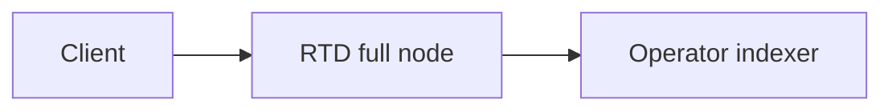

Architecture diagrams should describe the reviewed RTD source and deployed topology, not an inherited Sui public service. Use [the C4 model](https://c4model.com/) to choose whether a diagram shows a system, deployable service, component, or code path. Label each external system and data source as either deployed for the documented RTD network or illustrative.

For small flow and sequence diagrams, keep Mermaid source in the documentation so it can be reviewed with the prose:

For larger diagrams, store the editable source alongside an exported SVG or PNG. Include alt text, a caption, and a description of which network and revision the drawing represents. Review endpoints, bucket names, chain IDs, and third-party integrations before publication.

This repository does not verify a separate RTD diagrams GitHub repository, downloadable fonts bundle, public brand kit, or hosted design system. Use assets committed to the current project until maintainers publish and validate replacements. See [documentation contribution guidance](/references/contribute/contribution-process).
